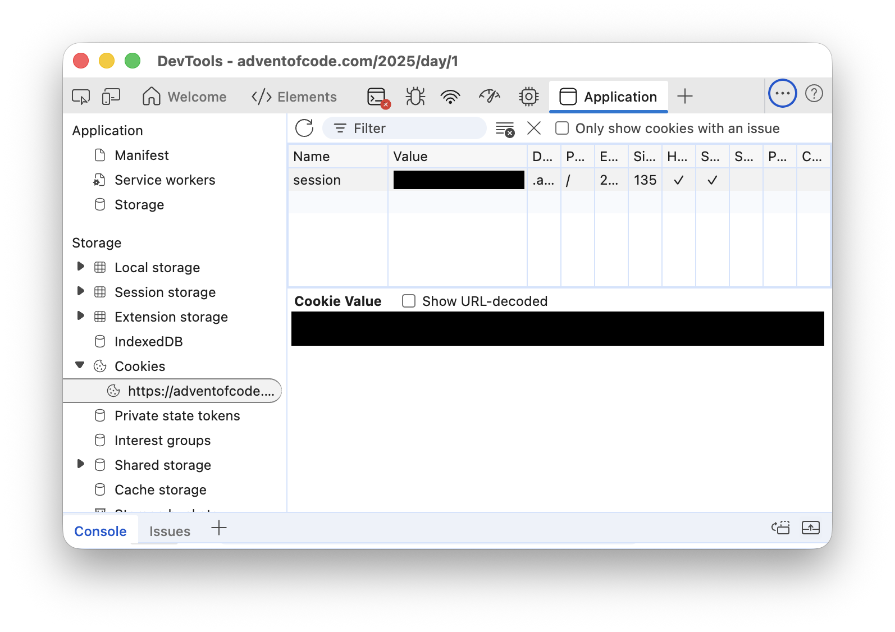

# Advent of Code (2025)

It's the advent of code.

## Usage

### Setting secrets

The [CLI](./src/Cli) automatically fetches inputs from the Advent of Code
website and passes them to the solutions.

Log in to [Advent of Code](https://adventofcode.com/). Then, open the browser
dev tools. Find the "session" cookie created by the site. On Chromium-based
browsers, this is under "Application" > "Storage" > "Cookies":



Set the .NET user-secret `AdventOfCodeOptions:SessionToken` to the value of the
session cookie:

```console
pushd src/Cli
dotnet user-secrets set "AdventOfCodeOptions:SessionToken" "$SESSION_COOKIE_VALUE"
popd
```

### Running

Use the `-h`/`--help` option to see all available command line options:

```console
$ ./run.sh -h

Options:
  --year <year>
  --day <day>
  --part <part>
  -?, -h, --help  Show help and usage information
  --version       Show version information
```
